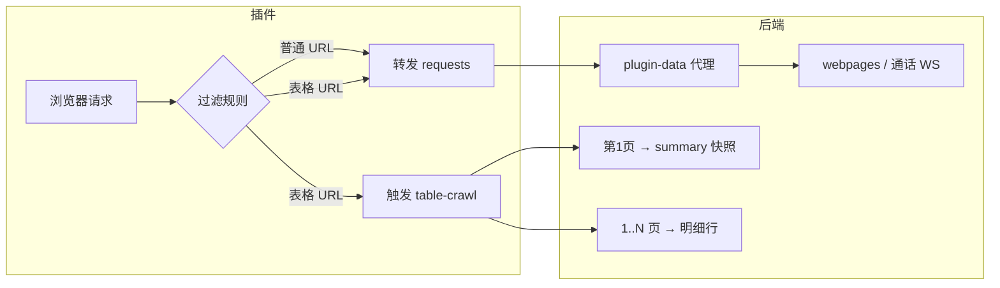

# CRM 抓取系统 — 预期逻辑与自测对照文档

> 适用版本：crawler-backend + crm-chrome-crawler 插件  
> 后端地址示例：`http://202.155.9.144:3000`  
> 文档日期：2026-06-03

---

## 1. 系统总览

浏览器插件捕获 CRM 页面网络请求，按 **三种路径** 处理：

| 类型 | 插件行为 | 后端接口 | 落库 | 5 分钟限制 |
|------|----------|----------|------|------------|
| **A. 普通代理抓取** | 转发到 `serverUrl` | `POST /api/plugin/requests` | `webpages` 等 | ❌ 无 |
| **B. 表格汇总** | 命中表格规则时额外触发 | `POST /api/plugin/table-crawl` | `voice_*_summaries` | ❌ 不限制 |
| **C. 表格明细** | 同上（后端自行翻页） | `POST /api/plugin/table-crawl` | `voice_*_records` | ✅ 只限制后台明细启动 |



**重要**：5 分钟限制只影响 **表格明细后台翻页是否重新启动**；不影响普通 `requests`，也不影响表格 `summary` 和第 1 页明细刷新。

---

## 2. 当前插件配置（对照用）

### 2.1 服务器地址

```
http://202.155.9.144:3000/api/plugin/requests
```

- 普通请求 → 发到上述地址  
- 表格抓取 → 插件自动替换为：  
  `http://202.155.9.144:3000/api/plugin/table-crawl`

> `serverUrl` 必须以 `/requests` 结尾，否则表格抓取不会触发。

### 2.2 URL 过滤规则（普通抓取）

```
*get_curcall_in.php?
*get_curcall_out.php?
*get_peer_status.php?
*cont_controler.php?
```

### 2.3 IP 过滤规则

```
203.175.165.11*
173.234.2.174*
```

### 2.4 表格分页 URL 规则

```
*/modules/cc_voiceivr*
*modules/cc_voiceop*
```

### 2.5 抓取类型（全部勾选）

- XHR 请求 (`xmlhttprequest`)
- Fetch 请求 (`fetch`)
- 主页面请求 (`main_frame`)
- 子页面请求 (`sub_frame`)

---

## 3. 插件侧过滤逻辑（预期）

### 3.1 是否抓取某 URL

```
1. 排除发往自己 serverUrl / table-crawl 的请求（防循环）
2. 若命中「表格分页 URL 规则」→ 直接放行（不要求同时命中 URL/IP 普通过滤）
3. 否则：URL 规则 AND IP 规则 都要满足
4. 若 URL/IP 规则都留空 → 抓取所有
```

| URL 示例 | 表格规则 | URL 规则 | IP 规则 | 是否抓取 |
|----------|----------|----------|---------|----------|
| `173.234.2.174/.../get_peer_status.php` | ❌ | ✅ | ✅ | ✅ 普通 |
| `173.234.2.174/.../cc_voiceivr/?mid=24` | ✅ | ❌ | — | ✅ 普通 + 表格 |
| `203.175.165.11/.../get_curcall_in.php` | ❌ | ✅ | ✅ | ✅ 普通 |
| 其他 IP 的 get_peer_status | ❌ | ✅ | ❌ | ❌ 不抓 |
| 无 Cookie 的任何 URL | — | — | — | ❌ 不转发 |

### 3.2 Cookie 要求

- **无 Cookie** → 不转发 `requests`，不触发 `table-crawl`
- 插件 Console 预期：`⏭️ 跳过无 Cookie 请求`

### 3.3 插件内部限流（≠ 后端 5 分钟）

| 参数 | 默认值 | 含义 |
|------|--------|------|
| `enableThrottle` | true | 转发队列限流 |
| `throttleInterval` | **100ms** | 两次转发最小间隔 |
| `timeout` | 5000ms | 单次转发超时 |

这是插件转发频率控制，与后端表格明细的 5 分钟限制无关。

---

## 4. 类型 A — 普通代理抓取

### 4.1 触发条件

同时满足：

1. 插件已启用  
2. 请求类型在勾选范围内  
3. 命中 URL + IP 过滤（或命中表格规则时的普通转发部分）  
4. 请求头含 **Cookie**

### 4.2 数据流

```
浏览器请求
  → 插件 POST /api/plugin/requests（dataType: request，含 Cookie）
  → 后端识别为代理请求，带 Cookie 再请求目标站
  → 响应写入 webpages（sourcePluginId: browser-extension-proxy）
  → 若 URL 含 get_peer_status / get_curcall_* / cont_controler
     → 额外推送 call-record WebSocket（内容未变可能跳过推送）
  → 插件 POST /api/plugin/requests（dataType: response，状态码）
```

### 4.3 预期频率

- **无 5 分钟节流**，可每隔数秒一次（如 `get_peer_status` 轮询）
- 后端日志示例：

```text
POST /api/plugin/requests
✅ 识别为插件代理请求格式
URL: http://173.234.2.174:55668/modules/get_peer_status.php?...
广播通话记录创建: get_peer_status
```

- 内容重复时可能看到：

```text
⏭️ 跳过重复记录推送: get_peer_status
```

（请求仍处理，只是 WebSocket 不重复推）

### 4.4 落库表

| 数据 | 表 |
|------|-----|
| 代理原始响应 | `webpages` |
| 通话类（通过 call-record 模块查询） | 基于 `webpages`，非 voice 表 |

### 4.5 自测 SQL

```sql
SELECT url, "sourcePluginId", "createdAt"
FROM webpages
WHERE url LIKE '%get_peer_status%'
ORDER BY "createdAt" DESC
LIMIT 5;
```

---

## 5. 类型 B + C — 表格抓取（汇总 + 明细）

### 5.1 触发条件

1. URL 命中表格规则（`cc_voiceivr` / `cc_voiceop`）  
2. 请求含 Cookie  
3. 插件额外 POST → `/api/plugin/table-crawl`

同一次页面加载通常会有：

- 1 次 `POST /api/plugin/requests`（普通转发，cc_voiceivr 页面 HTML 进 webpages）
- 1 次 `POST /api/plugin/table-crawl`（表格专用抓取）

### 5.2 后端策略映射

| URL 片段 | 策略 module | 明细表 | 汇总表 |
|----------|-------------|--------|--------|
| `cc_voiceivr` | `voice_ivr` | `voice_ivr_records` | `voice_ivr_summaries` |
| `cc_voiceop` | `voice_op` | `voice_op_records` | `voice_op_summaries` |

### 5.3 一次 table-crawl 的完整时序

```
阶段 0  前置检查
  └─ URL / mid / Cookie 可用性检查

阶段 1  同步（API 返回前，约 100~200ms）
  ├─ 抓第 1 页（自动加 pageID=1）
  ├─ 解析：汇总 / 总页数 / 第 1 页明细
  ├─ 计算 pagesToFetch（增量页数）
  ├─ 写入第 1 页明细（去重）
  ├─ ★ 立即写入 summary 快照
  └─ 判断是否启动后台明细任务

阶段 2  异步（不阻塞 API）
  ├─ 若 5 分钟明细限制未命中，且没有后台明细任务 → 抓第 2 .. pagesToFetch 页
  ├─ 若 5 分钟内重复触发 → 只刷新 summary / 第 1 页，不启动后台明细
  ├─ 若后台明细仍在跑 → 只刷新 summary / 第 1 页，不重复启动后台明细
  ├─ 每页间隔 200ms
  ├─ 单页失败：重试 3 次 → 进失败队列 → 继续下一页
  └─ 全部完成后补抓失败页一轮
```

### 5.4 汇总（类型 B）预期

| 项目 | 说明 |
|------|------|
| **写入时机** | 每次 table-crawl 抓到当前第 1 页后 **立即** 写入 |
| **写入方式** | 每次追加新行，不 UPDATE 旧行 |
| **有效条件** | HTML 含 `語音紀錄分析：数字`（summaryMatched=true） |
| **字段示例** | totalRecords=152656, noAnswer, connected, totalPages=15266 |
| **WS 事件** | `table-crawl:summary` |
| **是否受 5 分钟影响** | 不受影响；5 分钟内重复请求也会刷新 |
| **是否受后台 busy 影响** | 不受影响；明细后台还在跑时也会刷新 |

### 5.5 明细（类型 C）预期

| 项目 | 说明 |
|------|------|
| **写入时机** | 第 1 页每次同步写；第 2..N 页是否后台跑受 5 分钟/ busy 控制 |
| **每页行数** | 约 10 条（由 CRM 分页决定） |
| **去重** | `(mid, recordId)` 唯一，`orIgnore` |
| **WS 事件** | 仅有新 recordId 时推 `table-crawl:rows` |
| **进度** | `table-crawl:progress`（page / pagesToFetch / status） |

### 5.6 增量页数 pagesToFetch

读取最近有效 summary 的 `totalPages`：

| 场景 | pagesToFetch | 约新增明细 |
|------|--------------|------------|
| 首次（无有效 summary） | = 总页数（如 15266） | 全量 |
| 总页数 +10 | 11 | ~110 条 |
| 总页数不变 | **至少 10 页** | ~100 条（重复则 0） |
| 总页数变少 | = 新总页数 | 重新全量 |

公式：`max(10, newTotalPages - lastTotalPages + 1)`，再用当前总页数封顶。

### 5.7 后端 5 分钟限制 + busy 锁

| 状态 | API 响应 | summary | 明细 |
|------|----------|---------|------|
| 正常启动 | `success: true` | ✅ 立即写 | ✅ 开始抓 |
| 5 分钟内重复 | `success: true`, 带 `retryAfterMs` | ✅ 立即写 | 只写第 1 页，不启动后台 |
| 后台还在跑 | `success: true`, `busy: true` | ✅ 立即写 | 只写第 1 页，不重复启动后台 |
| 首页失败 | `success: false` | ❌ | ❌ |
| summary 未匹配 | `success: true` 但 warn | ❌ | 第 1 页可能有 |

---

## 6. 插件 Console 预期日志

### 6.1 普通 get_peer_status

```text
[DEBUG] 收到请求: xmlhttprequest http://173.234.2.174:.../get_peer_status.php?...
[抓取] 请求: GET ...
✅ 捕获到 Cookie: x-token=...
[转发] 尝试 #N: ...
[转发成功]: ...
```

**不应出现**：`[表格抓取] 触发后端分页`

### 6.2 打开 cc_voiceivr 子框架

```text
[DEBUG] 收到请求: sub_frame http://173.234.2.174:.../cc_voiceivr/?mid=24
[抓取] 请求: GET ...
✅ 捕获到 Cookie: ...
[转发] 尝试 #N: ...cc_voiceivr/?mid=24
[表格抓取] 触发后端分页: ...cc_voiceivr/?mid=24
[表格抓取] 已启动 voice_ivr mid=24 pages=1/15266
  或
[表格抓取] 已启动 voice_ivr mid=24 pages=10/15266
（5 分钟内重复或后台 busy 时，summary 仍会刷新，但后台明细不会重复启动）
[转发成功]: ...
```

### 6.3 后端预期日志（表格）

```text
POST /api/plugin/table-crawl
首页解析 voice_ivr:24: html=9314b rows=10 totalPages=15266
广播表格汇总: voice_ivr mid=24 pages=1/15266
POST /api/plugin/table-crawl 201
```

---

## 7. 自测用例清单

### 用例 1：普通通话轮询（类型 A）

| 步骤 | 操作 |
|------|------|
| 1 | 打开 CRM，保持页面运行 |
| 2 | 观察 `get_peer_status` 每几秒出现一次 |

| 检查项 | 预期 |
|--------|------|
| 插件 | `[转发成功]`，无 `[表格抓取]` |
| 后端 | `POST /api/plugin/requests` 201 |
| 5 分钟内多次 | 每次都处理，无 throttled |
| webpages | 持续有新记录 |

---

### 用例 2：首次打开 cc_voiceivr（类型 B+C）

| 步骤 | 操作 |
|------|------|
| 1 | 登录 CRM，打开语音记录页 `cc_voiceivr/?mid=24` |
| 2 | 看 Network / Console |

| 检查项 | 预期 |
|--------|------|
| 插件 | 同时有 `requests` 转发 + `table-crawl` 触发 |
| table-crawl 响应 | `success:true`, `pagesToFetch` ≈ 总页数 |
| 后端日志 | `首页解析 ... totalPages=15266` |
| summary | **几秒内**有新行 |

```sql
SELECT "totalRecords", "totalPages", "createdAt"
FROM voice_ivr_summaries WHERE mid = 24
ORDER BY "createdAt" DESC LIMIT 3;
```

| 明细 | 先增 10 条左右，随后后台慢慢增加 |

```sql
SELECT COUNT(*), MAX("createdAt") FROM voice_ivr_records WHERE mid = 24;
```

---

### 用例 3：5 分钟内再次刷新 cc_voiceivr

| 检查项 | 预期 |
|--------|------|
| 插件 Console | 仍会看到 `[表格抓取] 已启动 ...` 或成功响应 |
| table-crawl 响应 | `success: true`，可能带 `retryAfterMs` |
| summary | **有新快照** |
| 明细 | 第 1 页会尝试写入；后台 2..N 页不重新启动 |

---

### 用例 4：总页数不变，间隔 5 分钟后再触发

| 检查项 | 预期 |
|--------|------|
| table-crawl 响应 | `pagesToFetch: 10`（若总页数大于等于 10） |
| summary | **有新快照**（createdAt 更新，数字可能相同） |
| 明细 | 前 10 页会尝试写入；可能 0 条新增（recordId 重复） |

---

### 用例 5：后台全量任务进行中再触发

| 检查项 | 预期 |
|--------|------|
| 响应 | `success: true`, `busy: true` |
| summary | **有新快照** |
| 明细 | 只尝试第 1 页；不重复启动后台全量任务 |

---

### 用例 6：IP 不在白名单

| URL | 预期 |
|-----|------|
| `http://其他IP/.../get_peer_status.php` | 插件 `[DEBUG] URL 被过滤`，不转发 |
| `173.234.2.174/.../cc_voiceivr` | 仍抓取（表格规则 OR 放行） |

---

## 8. 三种类型对照速查

| | 普通代理 A | 表格汇总 B | 表格明细 C |
|--|-----------|-----------|-----------|
| **插件触发** | URL+IP 过滤 | 表格 URL 规则 | 同 B |
| **后端接口** | `/api/plugin/requests` | `/api/plugin/table-crawl` | 同 B |
| **5 分钟节流** | 无 | 无 | 只限制后台明细启动 |
| **写入时机** | 每次请求 | 第 1 页解析后立刻 | 第 1 页 + 后台 2..N 页 |
| **落库** | webpages | voice_*_summaries | voice_*_records |
| **重复数据** | 通话 WS 可能跳过 | 每次新快照 | recordId 去重跳过 |
| **典型 URL** | get_peer_status | cc_voiceivr 页头统计 | cc_voiceivr 表格行 |

---

## 9. 常见问题对照

| 现象 | 可能原因 | 怎么确认 |
|------|----------|----------|
| 插件无转发 | 未启用 / 无 Cookie / IP 或 URL 被过滤 | Console `[DEBUG]` 行 |
| get_peer_status 正常但表格无数据 | 未命中表格规则 / 无 Cookie | 是否有 `[表格抓取] 触发` |
| table-crawl 201 但 summary 无新增 | summaryMatched=false / 首页抓取内容不是表格页 | 看响应 JSON + 后端 warn 日志 |
| 明细一直不增加 | 后台 busy / 5 分钟内只刷 summary / 前 10 页 recordId 全重复 | 看 `busy`、`retryAfterMs`、`pagesToFetch` |
| summary 有、明细很少 | 正常：summary 是站点总数，明细按页增量抓 | 对比 totalRecords 与 COUNT(*) |
| 刷新多次 summary 有更新但明细不涨 | 后台明细仍在跑或 5 分钟内重复触发 | 看响应里的 `busy` / `retryAfterMs` |

---

## 10. 手动 curl 测试 table-crawl（可选）

```bash
curl -s -X POST 'http://202.155.9.144:3000/api/plugin/table-crawl' \
  -H 'Content-Type: application/json' \
  -d '{
    "url": "http://173.234.2.174:55668/modules/cc_voiceivr/?mid=24",
    "headers": [
      {"name": "Cookie", "value": "x-token=...; PHPSESSID=..."},
      {"name": "Referer", "value": "http://173.234.2.174:55668/modules/index.php"}
    ]
  }' | jq .
```

预期成功：

```json
{
  "success": true,
  "module": "voice_ivr",
  "mid": 24,
  "totalPages": 15266,
  "pagesToFetch": 10
}
```

---

## 11. 监控页

打开后端监控页观察 WebSocket 事件：

```
http://202.155.9.144:3000/api/monitor
```

| 事件 | 含义 |
|------|------|
| `table-crawl:summary` | 汇总快照已写入 |
| `table-crawl:rows` | 有新明细（去重后） |
| `table-crawl:progress` | 分页进度 running / completed / failed |
| `call-record:created` | 普通通话类代理有新数据 |

---

*文档与代码对应：`crawler-backend/src/modules/voice-table/` + `crm-chrome-crawler/background.js`*
