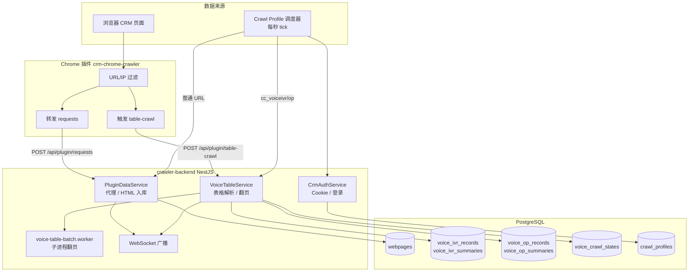

# CRM 数据抓取方案 — 完整说明

> 适用项目：`crawler-backend` + `crm-chrome-crawler`  
> 文档日期：2026-06-10  
> 本文档整合插件被动抓取与服务端主动调度两条主线，反映当前代码与数据库迁移（含 011/012）的实际行为。

---

## 1. 方案概述

本系统从 **CRM 呼叫中心后台** 持续采集四类数据：

| 数据类型 | CRM 模块 | 典型用途 |
|----------|----------|----------|
| 分机/坐席状态 | `get_peer_status` | 实时在线状态 |
| 语音呼叫状态 | `get_curcall_in/out`、`cont_controler` | 当前呼入/呼出、控制面板 |
| 并发状态 | `cc_mrcall` | 并发通话统计 |
| 语音记录（IVR） | `cc_voiceivr` | 語音紀錄明细与汇总 |
| 人工记录（OP） | `cc_voiceop` | 人工紀錄明细与汇总 |

**核心设计原则：**

1. **双路径触发** — 浏览器插件被动转发 + 服务端 Crawl Profile 主动调度，互为补充。
2. **表格与代理分离** — 普通 URL 走代理存快照；表格 URL 额外触发后端自动翻页、解析、落库。
3. **增量优先、按需全量** — 大表（IVR 上万页）按增量策略抓；小表（OP ≤100 页）可全量扫。
4. **多 CRM 隔离** — 以 `crmKey`（host:port）区分不同 CRM 实例的数据。
5. **状态可恢复** — 断点续抓、历史补全、IVR「初始狀態」补偿，保证数据最终一致。

---

## 2. 系统架构



### 2.1 技术栈

| 层级 | 技术 |
|------|------|
| 后端框架 | NestJS 11 + TypeScript |
| 数据库 | PostgreSQL 16 + TypeORM |
| 定时调度 | `@nestjs/schedule`（Crawl Profile 每秒扫描） |
| HTML 解析 | Cheerio（表格策略） |
| 实时推送 | Socket.IO（namespace `/ws`） |
| 部署 | Docker Compose（postgres + app） |

### 2.2 主要模块

| 模块 | 路径 | 职责 |
|------|------|------|
| PluginData | `src/modules/plugin-data/` | 插件数据入口、HTTP 代理、Cookie 同步 |
| CrawlProfile | `src/modules/crawl-profile/` | 多 CRM 账号配置、认证、服务端定时抓取 |
| VoiceTable | `src/modules/voice-table/` | 语音/人工表格分页抓取、解析、落库 |
| CallRecord | `src/modules/call-record/` | 实时通话状态（内存 + WebSocket） |
| Monitor | `public/monitor.html` | 请求与表格抓取实时监控 |

---

## 3. 两条抓取路径

### 3.1 路径 A：Chrome 插件（被动触发）

**适用场景：** 运维人员打开 CRM 页面时自动采集；或 Crawl Profile 遇验证码时，通过浏览器手动登录后同步 Cookie。

```
浏览器发起 CRM 请求
  → 插件过滤（URL 规则 + IP 白名单 + Cookie 检查）
  → POST /api/plugin/requests（普通 URL）
  → POST /api/plugin/table-crawl（表格 URL，额外触发）
  → 后端处理并落库
```

**插件配置示例：**

| 配置项 | 示例值 |
|--------|--------|
| 服务器地址 | `http://your-server:3000/api/plugin/requests` |
| URL 过滤 | `*get_curcall_in.php*`、`*get_peer_status.php*` 等 |
| IP 白名单 | `173.234.2.174*`、`203.175.165.11*` |
| 表格 URL 规则 | `*/modules/cc_voiceivr*`、`*modules/cc_voiceop*` |

**前提：** 请求头必须含 Cookie，否则插件跳过转发。

**举例 — 打开语音记录页：**

1. 浏览器加载 `http://173.234.2.174:55668/modules/cc_voiceivr/?mid=24`
2. 插件同时做两件事：
   - 转发 HTML 到 `/api/plugin/requests` → 存入 `webpages`
   - 触发 `/api/plugin/table-crawl` → 后端解析第 1 页、写 summary、后台翻页写明细

插件 Console 预期：

```text
[表格抓取] 触发后端分页: .../cc_voiceivr/?mid=24
[表格抓取] 已启动 voice_ivr mid=24 pages=10/15266
```

---

### 3.2 路径 B：Crawl Profile（服务端主动调度）

**适用场景：** 7×24 无人值守抓取，不依赖浏览器保持页面打开。

```
CrmRequestSchedulerService（每秒 tick）
  → 遍历 enabled 的 crawl_profiles
  → 按 intervalMs 判断是否到期
  → CrmAuthService 获取 Cookie（自动登录或缓存）
  → CrmRequestRunnerService 执行对应任务
     ├─ 普通 URL → PluginDataService.proxyRequest
     └─ 表格 URL → VoiceTableService.startCrawl
```

**管理入口：** `http://your-server:3000/api/crawl-profiles/page`  
（需配置 `CRAWL_ADMIN_USERNAME` / `CRAWL_ADMIN_PASSWORD`）

**举例 — 配置一组 CRM 账号：**

```json
{
  "name": "主站 CRM",
  "baseUrl": "http://173.234.2.174:55668",
  "username": "admin",
  "password": "******",
  "enabled": true,
  "contents": ["voiceCallStatus", "voiceRecords", "manualRecords"],
  "mids": {
    "voiceCallStatus": 9,
    "voiceRecords": 24,
    "manualRecords": 25
  }
}
```

启用后，后端会自动每 600ms 抓 `get_curcall_in`、每 5 分钟触发表格抓取，无需打开浏览器。

---

## 4. 抓取内容与调度频率

### 4.1 Crawl Profile 任务映射

| 勾选内容 (`contents`) | TaskKey | CRM 端点 | 间隔 |
|----------------------|---------|----------|------|
| 任意一项 | `get_peer_status` | `/modules/get_peer_status.php` | 5 秒 |
| 语音呼叫状态 | `get_curcall_in` | `/modules/cc_monitor/get_curcall_in.php` | **600ms** |
| 语音呼叫状态 | `get_curcall_out` | `/modules/cc_monitor/get_curcall_out.php` | **1.2s** |
| 语音呼叫状态 | `cont_controler` | `/modules/cc_monitor/cont_controler.php?mid=9` | 20s |
| 并发状态 | `cc_mrcall` | `/modules/cc_mrcall/?mid=5` | 30s |
| 语音记录 | `cc_voiceivr` | `/modules/cc_voiceivr/?mid=24` | **5 分钟** |
| 语音记录 | `cc_voiceivr_initial_refresh` | 同上（初始状态补偿） | **60 秒** |
| 人工记录 | `cc_voiceop` | `/modules/cc_voiceop/?mid=25` | **5 分钟** |

> `get_peer_status` 全局去重：同一 Profile 勾选多项时只调度一路，避免重复请求。

### 4.2 插件路径的频率

| 类型 | 频率限制 |
|------|----------|
| 普通代理（`requests`） | **无** 5 分钟限制，随 CRM 页面轮询频率 |
| 表格 summary + 第 1 页 | **无** 限制，每次触发都刷新 |
| 表格后台明细翻页 | **5 分钟节流**（仅限制是否重新启动后台任务） |

插件内部有 100ms 转发限流，与后端 5 分钟节流无关。

---

## 5. 多 CRM 隔离（crmKey）

每个 CRM 实例以 **`crmKey = host[:port]`**（小写）标识，例如 `173.234.2.174:55668`。

**隔离范围：**

- `voice_ivr_records` / `voice_op_records`（明细）
- `voice_ivr_summaries` / `voice_op_summaries`（汇总快照）
- `voice_crawl_states`（翻页进度）

**来源：**

- Crawl Profile 的 `baseUrl`
- 插件请求 URL 的 host 部分

**举例：** 同一后端管理两个 CRM：

| Profile | baseUrl | crmKey |
|---------|---------|--------|
| 站点 A | `http://173.234.2.174:55668` | `173.234.2.174:55668` |
| 站点 B | `http://203.175.165.11:8080` | `203.175.165.11:8080` |

两站点的 `recordId=12345` 互不冲突，因唯一键含 `crmKey`。

---

## 6. 认证与 Cookie 管理

### 6.1 服务端自动登录

`CrmAuthService` 使用 Profile 中的账号密码向 CRM 发起程序登录：

- Cookie 内存缓存 **30 分钟**，成功请求后自动续期
- 登录失败 → `authStatus = login_failed`，暂停该 Profile 调度
- 遇真人验证码 → `authStatus = human_check_required`，暂停调度

### 6.2 插件 Cookie 回退

当 Profile 处于 `human_check_required` 时：

1. 在浏览器中手动登录 CRM 并完成验证码
2. 确保 Profile 的 `baseUrl` 与浏览器打开的 CRM **主机名和端口一致**
3. 插件将带 Cookie 的请求转发到后端
4. 后端 `ingestPluginCookies` 写入对应 Profile，状态恢复为 `ok`

### 6.3 Telegram 通知（可选）

配置 `TELEGRAM_BOT_TOKEN` 和 `TELEGRAM_CHAT_IDS`，登录异常时可推送告警。

---

## 7. 普通代理抓取（类型 A）

### 7.1 数据流

```
请求（含 Cookie）
  → PluginDataService.proxyRequest
  → 带 Cookie 再请求 CRM
  → 响应写入 webpages
  → 若 URL 为通话类 → 推送 call-record WebSocket
```

### 7.2 识别的通话类 URL

- `get_peer_status`
- `cont_controler`
- `get_curcall_in` / `get_curcall_out`

### 7.3 去重策略

同类型 URL 在 **60 秒内** 内容 hash 相同 → 可跳过 WebSocket 推送（请求仍处理、仍落库）。

### 7.4 举例

CRM 页面每 5 秒轮询一次 `get_peer_status.php`：

```text
POST /api/plugin/requests 201
✅ 识别为插件代理请求格式
URL: http://173.234.2.174:55668/modules/get_peer_status.php?date=...
广播通话记录创建: get_peer_status
```

查询最近快照：

```sql
SELECT url, "sourcePluginId", "createdAt"
FROM webpages
WHERE url LIKE '%get_peer_status%'
ORDER BY "createdAt" DESC
LIMIT 5;
```

---

## 8. 表格抓取（类型 B + C）

表格 URL 命中 `cc_voiceivr` 或 `cc_voiceop` 时，走专用流程。

### 8.1 策略映射

| URL 片段 | module | CRM 页面 | 明细表 | 汇总表 |
|----------|--------|----------|--------|--------|
| `cc_voiceivr` | `voice_ivr` | 語音紀錄 | `voice_ivr_records` | `voice_ivr_summaries` |
| `cc_voiceop` | `voice_op` | 人工紀錄 | `voice_op_records` | `voice_op_summaries` |

翻页方式：在 URL 上追加 `pageID=N` 参数。

### 8.2 一次抓取的完整时序

```
阶段 0  前置检查
  └─ URL / mid / Cookie / 策略解析

阶段 1  同步（API 返回前，约 100~200ms）
  ├─ 抓第 1 页（pageID=1）
  ├─ Cheerio 解析：汇总统计、总页数、第 1 页明细行
  ├─ 计算 pagesToFetch（见第 9 节）
  ├─ UPSERT 第 1 页明细
  ├─ ★ 立即写入 summary 快照（追加新行）
  └─ 判断是否启动后台明细任务

阶段 2  异步（Worker 子进程或主进程后台）
  ├─ 翻页抓第 2 .. N 页（并发 3，页间延迟 50~200ms）
  ├─ 每 50 页写一次 checkpoint 到 voice_crawl_states
  ├─ 单页失败：重试 2 次 → 进失败队列 → 继续下一页
  ├─ 全部完成后补抓一轮失败页
  └─ IVR 大表：第 11 页起交由 history 批次补全（50 页/批）
```

### 8.3 汇总 vs 明细

| 维度 | 汇总（类型 B） | 明细（类型 C） |
|------|---------------|---------------|
| 写入时机 | 第 1 页解析后 **立即** | 第 1 页同步 + 后台 2..N 页 |
| 写入方式 | 每次 **追加** 新快照行 | UPSERT 按唯一键合并 |
| 受 5 分钟节流影响 | ❌ 否 | ✅ 仅限制后台启动 |
| 受 busy 锁影响 | ❌ 否 | ✅ 后台仍在跑时不重复启动 |
| WebSocket 事件 | `table-crawl:summary` | `table-crawl:rows` / `progress` |

### 8.4 举例 — 首次打开 cc_voiceivr

假设 CRM 显示：总记录 152,656 条，共 15,266 页。

**后端日志：**

```text
首页解析 voice_ivr:24: html=9314b rows=10 totalPages=15266
广播表格汇总: voice_ivr mid=24 pages=1/15266
```

**API 响应：**

```json
{
  "success": true,
  "module": "voice_ivr",
  "mid": 24,
  "totalPages": 15266,
  "pagesToFetch": 10
}
```

**数据库变化：**

```sql
-- 几秒内出现 summary 快照
SELECT "totalRecords", "totalPages", "createdAt"
FROM voice_ivr_summaries
WHERE "crmKey" = '173.234.2.174:55668' AND mid = 24
ORDER BY "createdAt" DESC LIMIT 1;
-- totalRecords=152656, totalPages=15266

-- 明细先增 ~10 条，随后后台慢慢增加
SELECT COUNT(*) FROM voice_ivr_records
WHERE "crmKey" = '173.234.2.174:55668';
```

> 注意：summary 里的 `totalRecords` 是 CRM 站点总数；`voice_ivr_records` 的行数是已抓取的增量，两者数量级可能差很多，属正常现象。

---

## 9. 页数决策逻辑

`VoiceTableService.startCrawl` 按以下 **优先级** 决定本次抓多少页：

```
1. OP 且 totalPages ≤ 100  →  全量更新（小站直接扫完）
2. 每日初始锚点（业务日变化）  →  扫前 10 页 + IVR 尾页锚点检测
3. IVR 增量查重  →  最多 10 页，遇整页重复则提前停止
4. 断点续抓（上次 status=running 中断）  →  从 checkpoint 续跑
5. 普通增量  →  max(10, 新增页数+1)，封顶 10 页；总页数减少则全量
```

### 9.1 关键常量

| 常量 | 值 | 含义 |
|------|-----|------|
| `THROTTLE_MS` | 5 分钟 | 明细后台重启节流 |
| `MIN_DETAIL_PAGES_PER_RUN` | 10 | 增量至少扫 10 页 |
| `VOICE_TABLE_DAILY_MAX_PAGES` | 10 | 单次日常扫描上限 |
| `HISTORY_BATCH_SIZE` | 50 | 历史补全每批页数 |
| `TABLE_PAGE_CONCURRENCY` | 3 | 翻页并发 |
| `VOICE_OP_FULL_SCAN_MAX_PAGES` | 100 | OP 小站全量阈值 |

### 9.2 举例 — 不同场景下的 pagesToFetch

| 场景 | 上次 totalPages | 本次 totalPages | pagesToFetch | 说明 |
|------|----------------|----------------|--------------|------|
| 首次抓取 | — | 15,266 | 10（日常上限） | 剩余页由 history 批次补全 |
| 总页数 +10 | 15,266 | 15,276 | 11 → 封顶 10 | 增量 |
| 总页数不变 | 15,266 | 15,266 | 10 | IVR 整页查重，可能提前停 |
| 总页数变少 | 15,266 | 15,200 | 15,200 | 触发全量 |
| OP 共 80 页 | — | 80 | 80 | 小站全量 |
| 业务日切换 | — | 15,266 | 10 + 尾页锚点 | 每日初始锚点 |

### 9.3 5 分钟节流与 busy 锁

| 状态 | summary | 第 1 页明细 | 后台 2..N 页 |
|------|---------|------------|-------------|
| 正常 | ✅ | ✅ | ✅ 启动 |
| 5 分钟内重复触发 | ✅ | ✅ | ❌ 不重启 |
| 后台仍在跑（busy） | ✅ | ✅ | ❌ 不重复启动 |
| 有断点/每日锚点待补 | ✅ | ✅ | ✅ 跳过节流 |

---

## 10. 增量、全量、历史补全与 IVR 初始状态补偿

### 10.1 概念对照

| 模式 | 触发条件 | 行为 |
|------|----------|------|
| **首次 / 全量** | 无 crawl_state；总页数减少；OP ≤100 页 | 尽可能扫完全部或新总页数 |
| **日常增量** | 常规 5 分钟调度；总页数略增或不变 | 扫前 10 页，IVR 遇重复提前停 |
| **每日初始锚点** | 业务日与 `initialCompletedDate` 不同 | 扫 10 页 + 检测尾页锚点，标记当日完成 |
| **历史补全** | IVR 大表第 11 页以后 | `historyStatus=pending`，50 页/批后台续跑 |
| **IVR 初始状态补偿** | 入库时 `statusType=初始狀態` | 按 dst 分组轮询刷新，直到状态变更或超时 |

### 10.2 历史补全（History Batch）

IVR 表可能有上万页，单次任务只扫前 10 页。第 11 页起由 `voice_crawl_states` 中的历史游标驱动：

| 字段 | 含义 |
|------|------|
| `historyStatus` | `pending` / `running` / `completed` |
| `historyNextPage` | 下一批起始页 |
| `historyTotalPagesRef` | 参考总页数（应对页码漂移） |

Worker 以 `mode=history` 启动，每批 50 页，直到 `historyStatus=completed`。

### 10.3 IVR「初始狀態」补偿

**背景：** CRM 中新建的语音记录先显示「初始狀態」，数分钟后才变为最终状态（如「已接通」「未接」）。若只抓一次，状态会停留在中间态。

**机制（迁移 011 + `refreshInitialIvrRecords`）：**

1. 入库时若 `statusType === '初始狀態'` → 标记 `needsRefresh=true`
2. 设置刷新窗口：
   - `refreshAfter = createdAt + 2 分钟`（首次延迟）
   - `refreshUntil = createdAt + 1 小时`（最长跟踪）
3. 调度任务 `cc_voiceivr_initial_refresh`（**每 60 秒**）：
   - 按 **distinct dst** 分组
   - 每轮最多 50 个 dst，并发 3
   - 请求：`/modules/cc_voiceivr/?mid=24&ft[name]={dst}&ft[disposition]=0`
4. 重试间隔：2min → 5min → 10min（按 `refreshAttempts` 递增）
5. 超过 `refreshUntil` → 清除 `needsRefresh`，停止跟踪

**举例：**

某 dst=`13800138000` 的记录在 10:00 入库，状态为「初始狀態」：

```
10:00  入库，needsRefresh=true，refreshAfter=10:02
10:02  首次补偿请求，CRM 仍返回「初始狀態」→ refreshAttempts=1，下次 10:07
10:07  二次请求，CRM 返回「已接通」→ UPSERT 更新 statusType，needsRefresh=false
```

---

## 11. 数据模型与唯一键

### 11.1 核心表

| 表名 | 用途 |
|------|------|
| `crawl_profiles` | 抓取账号配置 |
| `webpages` | 代理/HTML 快照 |
| `voice_ivr_records` | IVR 明细 |
| `voice_ivr_summaries` | IVR 汇总快照（追加） |
| `voice_op_records` | OP 明细 |
| `voice_op_summaries` | OP 汇总快照（追加） |
| `voice_crawl_states` | 翻页/历史进度 |

### 11.2 唯一键（以迁移 011/012 为准）

**IVR 明细：**

| 条件 | 唯一键 |
|------|--------|
| 有 callDate | `(crmKey, recordId, callDate::date)` |
| 无 callDate | `(crmKey, recordId)` |

**OP 明细：**

| 条件 | 唯一键 |
|------|--------|
| 有 callDate | `(crmKey, src, dst, callDate::date)` |

> **mid 不参与记录唯一性**，仅作为 CRM 请求参数和记录字段保留。同一 CRM 下相同 recordId 在不同 mid 请求中会被合并为一条。

**crawl_states：**

```
(crmKey, module, mid)  — 唯一
```

### 11.3 UPSERT 行为

明细写入使用 PostgreSQL `ON CONFLICT ... DO UPDATE`：相同唯一键的记录会更新字段（如 statusType、duration 等），而非重复插入。

### 11.4 IVR 补偿相关字段

| 字段 | 说明 |
|------|------|
| `needsRefresh` | 是否需要初始状态补偿 |
| `refreshAfter` | 下次允许刷新时间 |
| `refreshUntil` | 补偿截止时间 |
| `refreshAttempts` | 已尝试次数 |
| `lastRefreshAt` | 上次刷新时间 |
| `lastSeenAt` | 上次在列表中出现时间 |

---

## 12. Worker 子进程

大表翻页在独立子进程中执行，避免阻塞主进程 Event Loop。

**启动方式：** `VoiceTableService` 通过 `child_process.fork('voice-table-batch.worker.ts')`

**运行模式：**

| mode | 用途 |
|------|------|
| `start` | 完整 startCrawl 流程（含首页 + 后台翻页） |
| `batch` | 纯翻页批处理 |
| `history` | 历史补全批次 |

**环境变量：**

| 变量 | 说明 |
|------|------|
| `VOICE_TABLE_WORKER_PAYLOAD` | JSON 任务参数 |
| `VOICE_TABLE_WORKER_ENABLED=false` | 禁用 worker，回退主进程同步执行 |
| `VOICE_TABLE_WORKER_TIMEOUT_MS` | 超时（默认 5 分钟） |

Worker 拥有独立 TypeORM 连接，逻辑与主进程保持一致（常量、页数决策、UPSERT 均复刻）。

---

## 13. 实时推送与监控

### 13.1 WebSocket 事件

连接：`ws://your-server/ws`

| 事件 | 含义 |
|------|------|
| `request:received` / `request:processed` | 插件代理请求 |
| `call-record:created` | 通话类代理有新数据 |
| `table-crawl:summary` | 表格汇总快照已写入 |
| `table-crawl:rows` | 有新明细行（去重后） |
| `table-crawl:progress` | 翻页进度 running / completed / failed |

### 13.2 监控页

| 页面 | 地址 | 功能 |
|------|------|------|
| 请求监控 | `/api/monitor` | 实时请求与表格抓取 |
| 抓取配置 | `/api/crawl-profiles/page` | Profile CRUD、测试登录、立即执行 |

---

## 14. 数据保留

`DataRetentionService` 每天 **03:20** 清理 **7 天前** 的数据：

- `webpages`
- `screenshots`
- `voice_ivr_records` / `voice_ivr_summaries`
- `voice_op_records` / `voice_op_summaries`

**不清理：** `voice_crawl_states`、`crawl_profiles`（保证进度与配置持久化）。

---

## 15. 部署架构

```yaml
# docker-compose.yml 概要
services:
  db:    PostgreSQL 16，volume postgres_data
  app:   NestJS 构建镜像，端口 ${PORT:-3000}，依赖 db healthy
```

**关键环境变量：**

| 变量 | 说明 |
|------|------|
| `CRAWL_ADMIN_USERNAME/PASSWORD` | 抓取配置管理登录 |
| `TELEGRAM_BOT_TOKEN/CHAT_IDS` | 登录异常通知 |
| `VOICE_TABLE_WORKER_ENABLED` | 是否启用 worker 子进程 |
| `DB_SYNCHRONIZE` | 开发 true / 生产 false（用 migrations） |

**健康检查：** `GET /api/health`

---

## 16. 典型场景 walkthrough

### 场景 1：纯插件模式（无 Crawl Profile）

运维打开 CRM 语音记录页，插件自动触发：

1. `requests` 转发页面 HTML
2. `table-crawl` 触发后端抓取
3. 5 秒内 summary 入库，明细后台增量增长
4. 关闭浏览器 → 抓取停止（无服务端调度）

### 场景 2：纯 Crawl Profile 模式（无浏览器）

配置 enabled Profile 后：

1. 每 600ms 自动抓呼入状态 → `webpages` + WebSocket
2. 每 5 分钟自动触发表格抓取 → summary + 增量明细
3. 每 60 秒 IVR 初始状态补偿
4. Cookie 30 分钟过期后自动重新登录

### 场景 3：验证码拦截 + 插件回退

1. 服务端登录遇验证码 → Profile 状态 `human_check_required`，调度暂停
2. 运维在浏览器手动登录同一 CRM
3. 插件转发带 Cookie 的请求 → 后端同步 Cookie
4. Profile 恢复 `ok`，自动调度继续

### 场景 4：IVR 大站首次接入

1. 首次 `table-crawl`：totalPages=15266，pagesToFetch=10
2. 第 1~10 页明细入库，summary 写入
3. `voice_crawl_states.historyStatus=pending`，historyNextPage=11
4. Worker 以 50 页/批后台补全，直至 history completed
5. 后续每 5 分钟增量扫前 10 页（整页重复则提前停）

### 场景 5：5 分钟内重复刷新页面

1. 第一次：启动后台翻页 10 页
2. 3 分钟后再次打开页面：
   - summary **仍会刷新**（新快照行）
   - 第 1 页明细 **仍会 UPSERT**
   - 后台 2..10 页 **不会重复启动**（5 分钟节流）
3. API 响应可能带 `retryAfterMs: 120000`

---

## 17. API 速查

### 插件专用

| 方法 | 路径 | 用途 |
|------|------|------|
| POST | `/api/plugin/requests` | 主入口：HTML / 代理 / 混合格式 |
| POST | `/api/plugin/table-crawl` | 表格专用：触发 startCrawl |
| POST | `/api/plugin/proxy` | 结构化代理请求 |

### Crawl Profile 管理

| 方法 | 路径 | 用途 |
|------|------|------|
| GET | `/api/crawl-profiles/page` | 管理页面 |
| POST | `/api/crawl-profiles/:id/run-once` | 立即执行全部任务 |
| POST | `/api/crawl-profiles/:id/test-login` | 测试 CRM 登录 |

### 查询

| 方法 | 路径 | 用途 |
|------|------|------|
| GET | `/api/call-records` | 通话记录 |
| GET | `/api/health` | 健康检查 |

---

## 18. 相关文档索引

| 文档 | 内容 |
|------|------|
| [CRAWL_LOGIC_SIMPLE.md](./CRAWL_LOGIC_SIMPLE.md) | 插件抓取逻辑简明版 |
| [CRAWL_EXPECTED_BEHAVIOR.md](./CRAWL_EXPECTED_BEHAVIOR.md) | 预期行为与自测对照 |
| [CRAWL_PROFILE_SETUP.md](./CRAWL_PROFILE_SETUP.md) | Crawl Profile 配置说明 |
| [VOICE_IVR_RECORDS_REQUESTS.md](./VOICE_IVR_RECORDS_REQUESTS.md) | IVR 请求细节 |
| [VOICE_CALL_STATUS_REQUESTS.md](./VOICE_CALL_STATUS_REQUESTS.md) | 通话状态请求细节 |
| [DEPLOYMENT_GUIDE.md](../DEPLOYMENT_GUIDE.md) | 部署指南 |

---

*文档对应代码：`src/modules/voice-table/`、`src/modules/crawl-profile/`、`src/modules/plugin-data/`、`src/workers/voice-table-batch.worker.ts`、`crm-chrome-crawler/background.js`*
