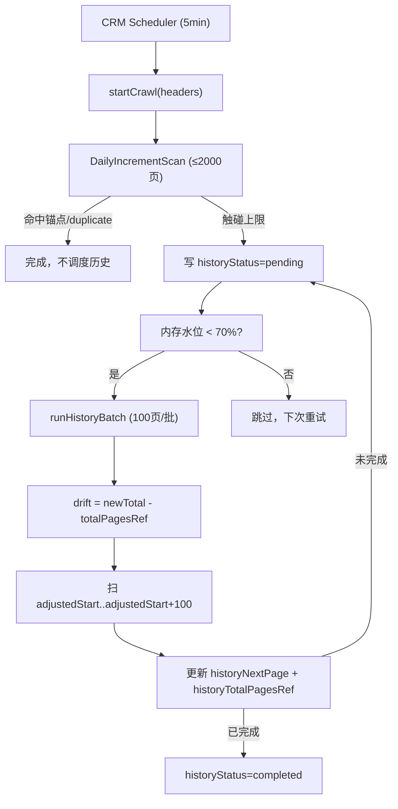

# 表格抓取内存治理方案

> 文档版本：2026-06-09  
> 背景：`voice_ivr mid=24` 每日初始锚点任务跑到 page=756/10889 时触发 Node.js OOM（堆接近 2GB），需要系统性解决大页量场景的内存与断点续跑问题。

---

## 问题分析

OOM 根因集中在 `voice-table.service.ts`：

```ts
if (needsIvrDailyAnchor) {
  pagesToFetch = newTotalPages; // 一次性扫 10889 页
  pageRanges = [{ start: 2, end: pagesToFetch, ... }];
}
```

每页处理链路：`fetchHtml → cheerio.load(全页 HTML) → strategy.parse → persistRows(全字段 RETURNING) → broadcastVoiceTableRows(全行 WS) → upsertCrawlState(findOne + update)`

多 CRM 叠加时内存风险按 CRM 数量线性放大。

---

## 解决方案

### 第一阶段：日常增量限页 + 历史补全分流

- 引入常量 `VOICE_TABLE_DAILY_MAX_PAGES = 2000`，每次日常扫描最多抓 2000 页。
- `needsIvrDailyAnchor` 不再从 page 2 扫到 10889，而是 cap 到 2000 页。
- 日常扫描触碰上限且未命中尾页锚点时，在 `voice_crawl_states` 写入历史补全游标字段（`historyStatus = 'pending'`、`historyNextPage`、`historyTotalPagesRef`）。
- 历史补全由 `scheduleAndRunHistoryBatch` 异步驱动，每批 100 页，每 5 分钟随日常任务触发一批（随下一次 `startCrawl` 调用启动，Cookie 由调用方提供）。

### 第二阶段：页码漂移感知

CRM 表格按最新记录倒序排列，新增记录会让所有历史记录向后漂移页码。  
解决方法：历史游标不保存静态页码段，保存：
- `historyNextPage`：上次批次结束时的页码  
- `historyTotalPagesRef`：上次批次时的总页数

每次领取新批次时计算漂移量：
```
drift = currentTotalPages - historyTotalPagesRef
adjustedStartPage = historyNextPage + drift
```

如果 `adjustedStartPage >= currentTotalPages`，说明历史数据全部处理完毕。

### 第三阶段：内存水位保护

在启动历史补全批次前检查内存水位：
- 堆使用率 < 70%：正常启动批次
- 堆使用率 70~85%：跳过本次批次（下次 5 分钟后重试）
- 堆使用率 > 85%：强制暂停，仅让当前批次收尾并写 checkpoint

在历史批次每页循环内也检查水位，超过 85% 立即 break 并保存进度。

### 第四阶段：单页内存与 IO 优化

| 优化点 | 现状 | 改后 |
|--------|------|------|
| Cheerio DOM | `cheerio.load(全页 HTML)` | 先切出 `#listDiv` 片段再加载 |
| INSERT RETURNING | 全部 11-14 字段 | 缩减为 6-8 个必要字段 |
| checkpoint 写库 | 每页一次 `findOne + update` | 每 50 页一次直接 `UPDATE`，首次插入才 `INSERT` |
| WS rows 推送 | 历史补全每页推全量行数组 | 历史模式跳过 rows 广播，只推 progress（每 50 页推一次） |

---

## 新增字段（voice_crawl_states）

| 字段 | 类型 | 说明 |
|------|------|------|
| `historyStatus` | `VARCHAR(16)` | `pending` / `running` / `completed` / `failed` |
| `historyNextPage` | `INTEGER` | 下次历史批次起始页（按上次结束时的页码基准） |
| `historyTotalPagesRef` | `INTEGER` | 上次批次时的 totalPages（用于计算漂移） |
| `historyLastRecordId` | `VARCHAR(128)` | 上次批次最后一条记录的 recordId（备用对齐） |
| `historyBatchStartedAt` | `TIMESTAMP` | 上次批次开始时间 |
| `historyBatchFinishedAt` | `TIMESTAMP` | 上次批次结束时间 |

---

## 数据流



---

## 预期效果

- OOM 消除：单次最多扫 2000 页，内存不再单调上升至 2GB。
- 数据不丢失：历史补全系统确保所有历史页面最终都会被扫描。
- 页码漂移安全：通过 drift 补偿而不是静态页码范围，重启后只重扫最近一批附近，不从 page 2 重来。
- 多 CRM 安全：内存水位检查防止同时运行多个大型历史批次。

---

## 验证清单

- [ ] `npm run build` 编译无报错
- [ ] 单 CRM 场景：voice_ivr mid=24 日常扫描 cap 在 2000 页，内存不超过 800MB
- [ ] 历史补全：每次 5 分钟触发时恢复一批，日志显示 `drift` 修正
- [ ] 断点续跑：重启后 `historyNextPage` 恢复上次位置
- [ ] 内存高水位：模拟 > 70% 堆占用，确认跳过历史批次
- [ ] 多 CRM：2-3 个 profile 同跑，`get_curcall_in/out` 仍持续更新
